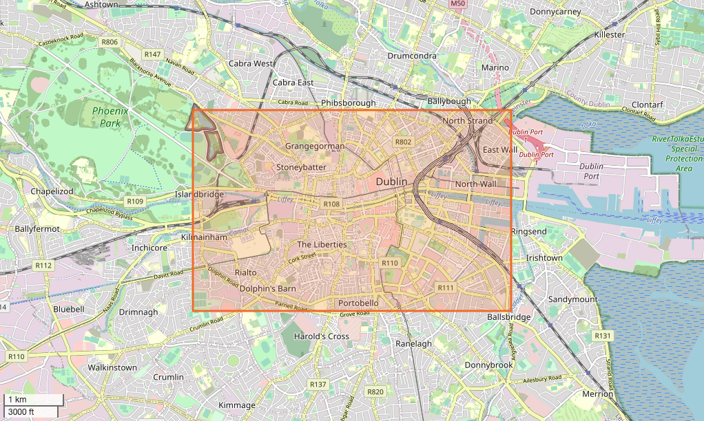
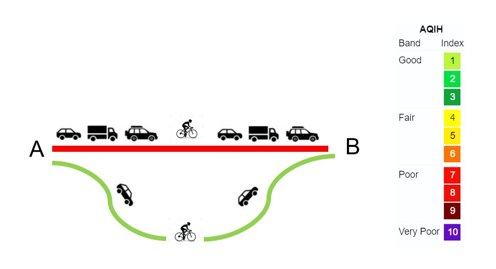
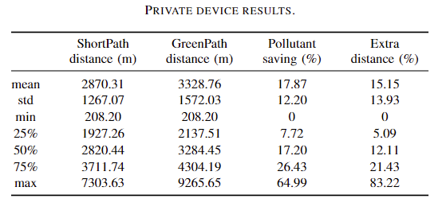
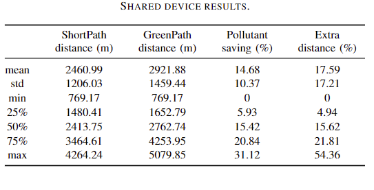

<h2 align="center"> Breathing Green </h2>

<p align="center"> An investigation through Google Air Quality dataset in Dublin. </p>

<p align="center">
  <a href="#Analysis">Analysis</a> | <a href="http://dx.doi.org/10.1109/ITSC57777.2023.10421940">Paper</a> | <a href="./data/README.md"> Docs </a> 
</p>

[](https://opensource.org/licenses/MIT)

---

*Yan, S., Zhu, S., Fernandez, J. B., Sánchez, E. A., Gu, Y., O'Connor, N. E., ... & Liu, M. (2023). Breathing Green: Maximising Health and Environmental Benefits for Active Transportation Users Leveraging Large Scale Air Quality Data. arXiv preprint arXiv:2307.15401.*

- <a href="http://dx.doi.org/10.1109/ITSC57777.2023.10421940"> IEEE Xplore </a>
- <a href="https://arxiv.org/abs/2307.15401"> arXiv </a>

If you feel our research and data useful, welcome to cite:

```
@inproceedings{Yan2023,
  title = {Breathing Green: Maximising Health and Environmental Benefits for Active Transportation Users Leveraging Large Scale Air Quality Data},
  url = {http://dx.doi.org/10.1109/ITSC57777.2023.10421940},
  DOI = {10.1109/itsc57777.2023.10421940},
  booktitle = {2023 IEEE 26th International Conference on Intelligent Transportation Systems (ITSC)},
  publisher = {IEEE},
  author = {Yan, Sen and Zhu, Shaoshu and Fernandez, Jaime B. and Sánchez, Eric Arazo and Gu, Yingqi and O’Connor, Noel E. and O’Connor, David and Liu, Mingming},
  year = {2023},
  month = sep 
}
```


# Background
 </img> 

Breathing Green is an air quality investigation project that originated from [Air Quality Data Hack](https://airqualitydatahack.com/) organized by Google. The main objective of this project is to recommend a green route to a cyclist that minimizes their exposure to pollutants by a specified pollutant index while travelling in Dublin from a specific starting point to a destination.

# Data
This repository contains the link for raw data acquired from Google AirQuality Hackthon and processed `csv`，`osm` files used in our research.

**Google Project Air View Data - Dublin City (May 2021 - August 2022)**: This dataset was collected by Google and Dublin City Council as part of Project Air View Dublin.
Google’s first electric Street View car, equipped with Aclima’s mobile air sensing platform, drove through the roads of Dublin City measuring street-by-street air quality. The data collection process predominantly took place from Monday to Friday between 9:00 am and 5:00 pm from May 2021 to August 2022.

For description of data pre-processing, check our <a href="http://dx.doi.org/10.1109/ITSC57777.2023.10421940"> Paper </a>:


For other pre-processed data, check <a href="./data/README.md"> Docs </a>

# Analysis

Pollutant saving and distance analysis on private devices and shared devices are listed as below:

</img> </img> 


# Demo

A <a href="https://www.youtube.com/shorts/Ji-2Svjrvfw"> Demo </a> was built to elaborate how the analysis could be applied in improving life quality of Dublin citizens.


---


